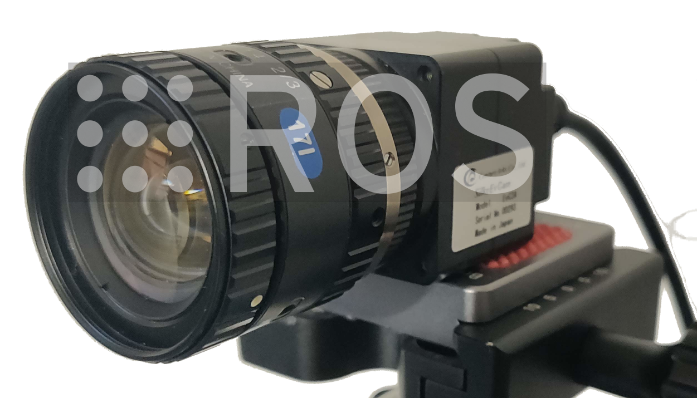

# metavision_driver

A combined ROS/ROS2 driver for event based cameras using Prophesee's Metavision SDK.
This driver is not written or supported by Prophesee.



If you are looking for more speed and features than the [official
Prophesee ROS
driver](https://github.com/prophesee-ai/prophesee_ros_wrapper) you
have found the right repository. This driver can cope with the large amount of
data produced by Prophesee's Gen3 and Gen4 sensors because it does
little more than getting the RAW (currently EVT3 format) events from
the camera and publishing them in ROS
[event_camera_msgs](https://github.com/ros-event-camera/event_camera_msgs)
format. 

The events can be decoded and displayed using the following ROS/ROS2 packages:

- [event_camera_codecs](https://github.com/ros-event-camera/event_camera_codecs)
  has C++ routines to decode event_camera_msgs.
- [event_camera_py](https://github.com/ros-event-camera/event_camera_py)
  module for fast event decoding in python.
- [event_camera_renderer](https://github.com/ros-event-camera/event_camera_renderer)
  a node / nodelet that renders and publishes ROS image messages.
- [event_camera_tools](https://github.com/ros-event-camera/event_camera_tools)
  a set of tools to echo, monitor performance and convert
  ``event_camera_msgs`` to legacy formats and into "RAW" format.

## Supported platforms

Tested on the following platforms:

- ROS Noetic
- ROS2 Humble (also compiles on other versions, see CI)
- Ubuntu 20.04, 22.04 LTS
- Metavision SDK (OpenEB) 4.2.0


Tested on the following hardware:

- [SilkyEVCam VGA (Gen 3.1 sensor)](https://centuryarks.com/en/silkyevcam-vga/)
- [SilkyEVCam HD (Gen 4 sensor)](https://centuryarks.com/en/silkyevcam-hd/)
- [Prophesee EVK4 (Gen 4 sensor)](https://www.prophesee.ai/event-camera-evk4/)

Explicitly not supported: any data in the old EVT2 format. The sensor
must produce data in the EVT3 format or later.

## How to build

Prerequisites:

- install [OpenEB](https://github.com/prophesee-ai/openeb)
- install ``vcs`` (ubuntu package ``python3-vcstool``).

Make sure you have your ROS1 or ROS2 environment sourced such that ROS_VERSION is set.
For example for ROS1 noetic:
```
source /opt/ros/noetic/setup.bash
```

Create a workspace (``metavision_driver_ws``), clone this repo, and use ``vcs``
to pull in the remaining dependencies:

```
pkg=metavision_driver
mkdir -p ~/${pkg}_ws/src
cd ~/${pkg}_ws
git clone https://github.com/ros-event-camera/metavision_driver.git src/${pkg}
cd src
vcs import < ${pkg}/${pkg}.repos
cd ..
```

Optional (ROS1): to use the efficient recording nodelet clone the
[nodelet_rosbag](https://github.com/berndpfrommer/nodelet_rosbag) repository into our src tree:
```
git clone -b open_bag_later git@github.com:berndpfrommer/nodelet_rosbag.git src/nodelet_rosbag
```

Now configure and build:

ROS1:
```
catkin config -DCMAKE_BUILD_TYPE=RelWithDebInfo  # (optionally add -DCMAKE_EXPORT_COMPILE_COMMANDS=1)
catkin build
. devel/setup.bash
```

ROS2:
```
colcon build --symlink-install --cmake-args -DCMAKE_BUILD_TYPE=RelWithDebInfo -DCMAKE_EXPORT_COMPILE_COMMANDS=ON
. install/setup.bash
```

## Driver Features

This driver differs from the Prophesee ROS driver in the following ways:

- publishes
  [event_camera_msgs](https://github.com/ros-event-camera/event_camera_msgs)
  that store more densely and are faster to access than the older
  message formats.
- less CPU consumption by avoiding unnecessary memory copies.
- implemented as nodelet such that it can be run in the same address space as
  e.g. a rosbag record nodelet without worrying about message loss in transmission.
- prints out message rate statistics so you know when the sensor
  saturates bandwidth.
- supports these additional features:
  - dynamic reconfiguration for bias parameters
  - ROI specification
  - camera synchronization (stereo)
  - external trigger events
  - event rate control

Parameters:

- ``bias_file``: path to file with camera biases. See example in the
  ``biases`` directory.
- ``from_file``: path to Metavision raw file. Instead of opening
  camera, driver plays back data from this file. This will not be in
  real time, usually faster.
- ``serial``: specifies serial number of camera to open (useful for
  stereo). To learn serial number format first start driver without
  specifying serial number and look at the log files.
- ``event_message_time_threshold``: (in seconds) minimum time span of
  events to be aggregated in one ROS event message before message is sent. Defaults to 1ms.
  In its default setting however the SDK provides packets only every 4ms. To increase SDK
  callback frequency, tune ``mipi_frame_period`` if available for your sensor.
- ``event_message_size_threshold``: (in bytes) minimum size of events
  (in bytes) to be aggregated in one ROS event message before message is sent. Defaults to 1MB.
- ``statistics_print_interval``: time in seconds between statistics printouts.
- ``send_queue_size``: outgoing ROS message send queue size (defaults
  to 1000 messages).
- ``use_multithreading``: decouples the SDK callback from the
  processing to ensure the SDK does not drop messages (defaults to
  false). The SDK already queues up messages but there is no documentation on
  the queue size and no way to determine if messages are dropped. Use multithreading to
  minimize the risk of dropping messages. However, be aware that this incurs an
  extra memory copy and threading overhead, raising the maximum CPU
  load by about 50% of a CPU. 
- ``frame_id``: the frame id to use in the ROS message header
- ``roi``: sets hardware region of interest (ROI). You can set
  multiple ROI rectangles with this parameter by concatenation:
  ``[top_left_x_1, top_left_y_1, width_1, height_1, top_left_x_2, top_left_y_2, width_2...]``.
  The length of the ``roi`` parameter vector must therefore be a multiple
  of 4. Beware that when using multiple ROIs, per Metavision SDK  documentation:
  ["Any line or column enabled by a single ROI is also enabled for all the other"](https://docs.prophesee.ai/stable/api/cpp/driver/features.html#_CPPv4N10Metavision3RoiE).
- ``erc_mode``: event rate control mode (Gen4 sensor): ``na``,
  ``disabled``, ``enabled``. Default: ``na``.
- ``erc_rate``: event rate control rate (Gen4 sensor) events/sec. Default: 100000000.
- ``mipi_frame_period``:: mipi frame period in usec. Only available on some sensors.
    Tune this to get faster callback rates from the SDK to the ROS driver. For instance 1008 will give a callback every millisecond. Risk of data corruption when set too low! Default: -1 (not set).
- ``sync_mode``: Used to synchronize the time stamps across multiple
  cameras (tested for only 2). The cameras must be connected via a
  sync cable, and two separate ROS driver nodes are started, see
  example launch files. The ``primary`` node's ``ready`` topic must be
  remapped so it receives the ``secondary`` node's ``ready`` messages.
  Allowed values:
   - ``standalone`` (default): freerunning camera, no sync.
   - ``primary``: camera that drives the sync clock. Will not start
     publishing data until it receives a ``ready`` message from the secondary.
   - ``secondary``: camera receiving the sync clock. Will send
     ``ready`` messages until it receives a sync signal from the primary.
- ``trigger_in_mode``: Controls the mode of the trigger input hardware.
  Allowed values:
   - ``disabled`` (default): Does not enable this functionality within the hardware
   - ``external``: Enables the external hardware pin to route to the trigger input hardware.
     This will be the pin on the camera's connector.
   - ``loopback``: Connects the trigger out pin to the trigger input hardware. Only available
     on Gen3 sensors (SilkyEVCam VGA).
- ``trigger_out_mode``: Controls the mode of the trigger output
  hardware. NOTE: 4-th gen sensors no longer support trigger out!
  Allowed values:
   - ``disabled`` (default): Does not enable this functionality within the hardware
   - ``enabled``: Enables the external hardware pin to route to the trigger in hardware.
- ``trigger_out_period``: Controls the period in microseconds of the trigger out pulse.
- ``trigger_out_duty_cycle``: Controls the duty cycle of the trigger
  out pulse. This is the period ratio.

Services:

- ``save_biases``: write out current bias settings to bias file. For
  this to work the ``bias_file`` parameter must be set to a non-empty value.


Dynamic reconfiguration parameters
(see [MetaVision documentation here](https://docs.prophesee.ai/stable/hw/manuals/biases.html)):

- ``bias_diff`` (read only)
- ``bias_diff_off``
- ``bias_diff_on``
- ``bias_fo``
- ``bias_hpf``
- ``bias_pr``
- ``bias_refr``


# How to use (ROS1):

```
roslaunch metavision_driver driver_node.launch   # (run as node)
roslaunch metavision_driver driver_nodelet.launch   # (run as nodelet)
```

The driver should print out message rate statistics like this:
```
[ INFO] [1663845360.494651335]: /event_camera: bw in: 106.08359 MB/s, msgs/s in:   51930, out:       0
```
Prints out the incoming (from the SDK) bandwidth and incoming and
published message rate. In multithreaded mode there will also be shown
the maximum queue size observed during
``statistics_print_interval``.

To use the combined driver/recording facility:
```
roslaunch metavision_driver recording_driver.launch bag:=`pwd`/test.bag
```
Then start/stop recording like this:
```
rosrun metavision_driver start_recording.py
rosrun metavision_driver stop_recording.py
```

To visualize the events, run a ``renderer`` node from the
[event_camera_renderer](https://github.com/ros-event-camera/event_camera_renderer) package:
```
roslaunch event_camera_renderer renderer.launch
```
The renderer node publishes an image that can be visualized with e.g. ``rqt_image_view``


# How to use (ROS2):

For efficient recording of the events you need to run the
driver and the recorder in the same address space as ROS2 composable
nodes. For this you will need to install the
[composable recorder](https://github.com/berndpfrommer/rosbag2_composable_recorder)
into your workspace as well (see below).

```
ros2 launch metavision_driver driver_node.launch.py        # (run as node)
ros2 launch metavision_driver driver_composition.launch.py # (run as composable node)
```
The printout should be similar to the one for ROS1.

To use the combined driver/recorder and start the recording:
```
ros2 launch metavision_driver recording_driver.launch.py
ros2 run rosbag2_composable_recorder start_recording.py
```
To stop the recording you have to kill (Ctrl-C) the recording driver.

To visualize the events, run a ``renderer`` node from the
[event_camera_renderer](https://github.com/ros-event-camera/event_camera_renderer) package:
```
ros2 launch event_camera_renderer renderer.launch.py
```
The renderer node publishes an image that can be visualized with e.g. ``rqt_image_view``

## CPU load

Here are some approximate performance numbers on a 16 thread (8-core) AMD
Ryzen 7480h laptop with max clock speed of 2.9GHz. All numbers were obtained
by producing maximum event rates about (48Mevs) with a SilkyEVCam:

### ROS1 

All CPU loads below are with sensor saturating at close to 50Mevs.

| settings                       | single threaded | multi threaded | note                                 |
|--------------------------------|-----------------|----------------|--------------------------------------|
| driver no subscriber           | 22%             | 59%            | no pub, extra copy for multithreaded |
| driver with subscriber         | 37%             | 61%            | does interprocess communication      |
| driver + rosbag record node    | 70%             | 96%            | combined driver + record cpu load    |
| driver + rosbag record nodelet | 52%             | 74%            | single process no ipc but disk/io    |


  

### ROS2

All CPU loads below are with sensor saturating at close to 50Mevs.
Middleware used was cyclonedds.

| settings                       | single threaded | multi threaded | note                                 |
|--------------------------------|-----------------|----------------|--------------------------------------|
| driver no subscriber           | 22%             | 59%            | no pub, extra copy for multithreaded |
| driver with subscriber         | 35%             | 44%            | does interprocess communication      |
| driver + rosbag record node    | 80%             | 90%            | combined driver + record cpu load    |
| driver + rosbag record composable | 58%          | 80%            | single process no ipc but disk/io    |

### About ROS time stamps

The SDK provides hardware event time stamps directly from the
camera. For efficiency reasons the packets are not decoded and so the
sensor time stamps are not available to the driver. Therefore the ROS driver
simply puts the host wall clock arrival time of the *first* SDK packet
into the ROS packet's header stamp field.

## About Trigger Pins

External triggers on prophesee cameras allows for a signal to be injected
into the event stream. This is useful for synchronizing external
devices. The event stream contained in the packages will now contain
trigger events that can be recovered with the decoder.

Prophesee provides documentation on the trigger functions at a high
level
[here](https://docs.prophesee.ai/stable/hw/manuals/timing_interfaces.html).

[Trigger out](https://docs.prophesee.ai/stable/hw/manuals/timing_interfaces.html#trigger-out)
functionality is exposed through ``trigger_out_mode``,
``trigger_out_period``, and ``trigger_out_duty_cycle``. These
variables follow the same meaning as laid out in the internal
documentation. 

- ``trigger_out_mode`` can be ``enabled`` or ``disabled``
- ``trigger_out_period`` can be from 2us to 1h (units are us)
- ``trigger_out_duty_cycle`` is the pulse width ratio
  (``trigger_out_period * trigger_out_duty_cycle`` must be at least 1us)

[Trigger in](https://docs.prophesee.ai/stable/hw/manuals/timing_interfaces.html#trigger-in)
functionality is abstracted away from pins to just ``loopback`` or
``external`` as the pin mappings are constant for a given camera
configuration. 

- ``trigger_in_mode`` allows the user to specify for each camera
  ``loopback`` or ``external`` and lookup which pins are associated
  with that camera. 

**WARNING** Running synchronization and triggers at the same time is
possible, but requires understanding of your camera's underlying
hardware (as most share trigger out and sync out pins). 

### Hardware configuration

The hardware configuration file is ``config/trigger_pins.yaml``. The
mappings for ``hal_plugin_gen*`` come from
[Prophesee
documentation](https://docs.prophesee.ai/3.1.2/metavision_sdk/modules/hal/samples/hal_viewer.html#configuring-trigger-in-and-trigger-out).
The mapping for ``evc3a_plugin_gen31`` has been validated on the
SilkyEvCam (March 2022). The mapping goes from the HAL Software Info
to pin numbers. 

If your camera is not yet supported, the software info is printed out
on driver startup. Look for a line that contains: 

```
Plugin Software Name:
```

This will be the key to place under ``prophesee_pin_config`` which can
then be populated based on your camera's documentation. 

**WARNING** If this file is not loaded (or your camera is not yet
supported), the default pin loaded will be 0. This may work in some
cases, but not all.

### SilkyEvCam

Documentation on the SilkyEvCam pinout can be found
[here on page 6](https://www.centuryarks.com/images/product/sensor/silkyevcam/SilkyEvCam-USB_Spec_Rev102.pdf).
This system uses 3.3V logic for both trigger in as well as trigger out. 

While the loopback configuration is internal to the chip, the trigger
out line will still pulse externally. This is useful if using an event
camera to trigger an external system as you will maintain the timing
relative to the internal clock (after association between the trigger
event and the external system). 

### Other cameras

External triggering works on SilkyEVCam HD, i.e. you can trigger the
SilkyEVCam HD externally the same way as the SilkyEVCam VGA.

## License

This software is issued under the Apache License Version 2.0.
