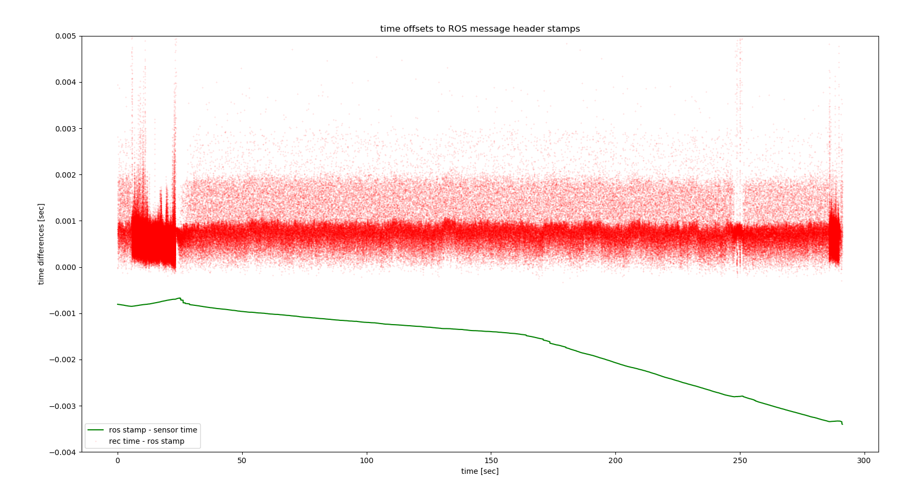

# metavision_ros_driver

A combined ROS/ROS2 driver for event based cameras using Prophesee's Metavision SDK.


This driver is not written or supported by Prophesee. It has several feature and performance improvements over the 
[official Prophesee
driver](https://github.com/prophesee-ai/prophesee_ros_wrapper).

## Supported platforms

Tested on the following platforms:

- ROS Noetic
- ROS2 Galactic
- Ubuntu 18.04 and 20.04 LTS
- Metavision SDK (OpenEB) 2.2.2 - 3.0.2

Note: there is currently a bug when using synchronization on
Metavision 2.3.2. Hold off on upgrading if you want to use
synchronization.

Tested on the following hardware:

- SilkyEVCam (Gen 3.1 sensor)

## How to build

Install the Metavision SDK or
[OpenEB](https://github.com/prophesee-ai/openeb), and maybe install wstool
(package python-wstool or python3-wstool).


Make sure you have your ROS1 or ROS2 environment sourced such that ROS_VERSION is set.
For example for ROS1 noetic:
```
source /opt/ros/noetic/setup.bash
```

Create a workspace (``metavision_ros_driver_ws``), clone this repo, and use ``wstool``
to pull in the remaining dependencies:

```
mkdir -p ~/metavision_ros_driver_ws/src
cd ~/metavision_ros_driver_ws
git clone git@github.com:berndpfrommer/metavision_ros_driver src/metavision_ros_driver
wstool init src src/metavision_ros_driver/metavision_ros_driver.rosinstall

# or to update an existing space
# wstool merge -t src src/metavision_ros_driver/metavision_ros_driver.rosinstall
# wstool update -t src
```

Now configure and build:

ROS1:
```
catkin config -DCMAKE_BUILD_TYPE=RelWithDebInfo  # (optionally add -DCMAKE_EXPORT_COMPILE_COMMANDS=1)
catkin build
. devel/setup.bash
```

ROS2:
```
colcon build --symlink-install --cmake-args -DCMAKE_BUILD_TYPE=RelWithDebInfo -DCMAKE_EXPORT_COMPILE_COMMANDS=ON
. install/setup.bash
```

## Driver Features

This driver differs from the Prophesee ROS driver in the following ways:

- can publish:
  - ``prophesee_msgs``: same as the Prophesee ROS driver
  - ``dvs_msgs``: permits using ROS1 pipelines developed for the DVS camera
  - ``event_array_msgs``: needed for ROS2 to get acceptable
     performance, loads much faster when accessed through rosbag read API
- less CPU consumption by avoiding unnecessary memory copies.
- implemented as nodelet such that it can be run in the same address space as
  e.g. a rosbag record nodelet without worrying about message loss in transmission.
- prints out message rate statistics so you know when the sensor
  saturates bandwidth.
- supports these additional features:
  - dynamic reconfiguration for bias parameters
  - ROI specification
  - camera synchronization (stereo)
  - external trigger events
- low jitter ROS stamps

Parameters:

- ``bias_file``: path to file with camera biases. See example in the
  ``biases`` directory.
- ``from_file``: path to Metavision raw file. Instead of opening
    camera, driver plays back data from this file.
- ``serial``: specifies serial number of camera to open (useful for
    stereo). To learn serial number format first start driver without
    specifying serial number and look at the log files.
- ``event_message_time_threshold``: (in seconds) minimum time span of
    events to be aggregated in one ROS event message before message is sent. Defaults to 100us.
- ``sensor_max_mevs``: (in Million Events/sec) maximum number of
    events per second that the sensor can produce. This helps the driver pre-allocate a
    correct size message to avoid unnecessary memory copies. Defaults
    to 50.
- ``trigger_message_time_threshold``: (in seconds) minimum time span
    of trigger events to be aggregated in one ROS event message before
    message is sent. Defaults to 100us. Set it to 0 if you want each
    trigger event to go out on a separate message immediately.
- ``trigger_max_freq``: (in Hz) maximum frequency with which an
    external trigger will fire. This helps the driver pre-allocate a
    correct size message to avoid unnecessary memory copies. Defaults
    to 1000.
- ``statistics_print_interval``: time in seconds between statistics printouts.
- ``message_type``: can be set to ``dvs``, ``prophesee`` or ``event_array``, depending on
  what message types the driver should publish. For ROS2 you must set
  it to ``event_array`` to get acceptable performance, since the
  marshalling/unmarshalling overhead is too large for the other
  message types.
- ``send_queue_size``: ros message send queue size (defaults to 1000).
- ``use_multithreading``: decouples the SDK callback from the
  processing to ensure the SDK does not drop messages (defaults to
  false). The SDK already queues up messages but there is no documentation on
  the queue size and no way to determine if messages are dropped. Use multithreading to
  minimize the risk of dropping messages. However, be aware that this incurs an
  extra memory copy and threading overhead, raising the maximum CPU
  load by about 50% of a CPU.
- ``frame_id``: the frame id to use in the ROS message header
- ``roi``: sets hardware region of interest (ROI). You can set
  multiple ROI rectangles with this parameter by concatenation:
  ``[top_left_x_1, top_left_y_1, width_1, height_1, top_left_x_2, top_left_y_2, width_2...]``.
  The length of the ``roi`` parameter vector must therefore be a multiple
  of 4. Beware that when using multiple ROIs, per Metavision SDK  documentation:
  ["Any line or column enabled by a single ROI is also enabled for all the other"](https://docs.prophesee.ai/stable/metavision_sdk/modules/driver/api/features.html#_CPPv4N10Metavision3RoiE).
- ``erc_mode``: event rate control mode (Gen4 sensor): ``na``,
  ``disabled``, ``enabled``. Default: ``na``.
- ``erc_rate``: event rate control rate (Gen4 sensor) events/sec. Default: 100000000.
- ``sync_mode``: Used to synchronize the time stamps across multiple
  cameras (tested for only 2). The cameras must be connected via a
  sync cable, and two separate ROS driver nodes are started, see
  example launch files. The ``primary`` node's ``ready`` topic must be
  remapped so it receives the ``secondary`` node's ``ready`` messages.
  Allowed values:
   - ``standalone`` (default): freerunning camera, no sync.
   - ``primary``: camera that drives the sync clock. Will not start
     publishing data until it receives a ``ready`` message from the secondary.
   - ``secondary``: camera receiving the sync clock. Will send
     ``ready`` messages until it receives a sync signal from the primary.
- ``trigger_in_mode``: Controls the mode of the trigger input hardware.
  Allowed values:
   - ``disabled`` (default): Does not enable this functionality within the hardware
   - ``enabled``: Enables the external hardware pin to route to the trigger input hardware.
     This will be the pin on the camera's connector.
   - ``loopback``: Connects the trigger out pin to the trigger input hardware.
- ``trigger_out_mode``: Controls the mode of the trigger output hardware.
  Allowed values:
   - ``disabled`` (default): Does not enable this functionality within the hardware
   - ``enabled``: Enables the external hardware pin to route to the trigger in hardware.
- ``trigger_out_period``: Controls the period in microseconds of the trigger out pulse.
- ``trigger_out_duty_cycle``: Controls the duty cycle of the trigger out pulse. This is the period ratio. 

Services:

- ``save_biases``: write out current bias settings to bias file. For
  this to work the ``bias_file`` parameter must be set to a non-empty value.


Dynamic reconfiguration parameters (see [MetaVision documentation here](https://docs.prophesee.ai/stable/hw/manuals/biases.html)):

- ``bias_diff`` (read only)
- ``bias_diff_off``
- ``bias_diff_on``
- ``bias_fo``
- ``bias_hpf``
- ``bias_pr``
- ``bias_refr``


# How to use (ROS1):

```
roslaunch metavision_ros_driver driver_node.launch   # (run as node)
roslaunch metavision_ros_driver driver_nodelet.launch   # (run as nodelet)
```

The driver should print out message rate statistics like this:
```
[ INFO] [1627733695.115154898]: rate[Mevs] avg:   0.007, max:   1.000, out sz:    3.06 ev, %on:  48 qs: 0
```
Prints out the average and maximum event rate (in million events per
second), the size (in number of events) of the outgoing ROS message, and the maximum
queue size (only non-zero if running in multithreaded mode) over the
``statistics_print_interval``. Note that for efficiency reasons the percentage of ON events,
is only computed if a subscriber is connected to the event topic.

To use the combined driver/recording facility:
```
roslaunch metavision_ros_driver recording_driver.launch bag:=`pwd`/test.bag
```
Then start/stop recording like this:
```
rosrun metavision_ros_driver start_recording.py
```
And stop recording:
```
rosrun metavision_ros_driver stop_recording.py
```

To visualize the events, run a ``slicer`` node from the
[event_ros_tools repo](https://github.com/ZiyunClaudeWang/event_ros_tools):
```
roslaunch event_ros_tools slicer_node.launch
```

# How to use (ROS2):

For efficient recording of the events you need to run the
driver and the recorder in the same address space as ROS2 composable
nodes. For this you will need to install the
[composable recorder](https://github.com/berndpfrommer/rosbag2_composable_recorder)
into your workspace as well.

```
ros2 launch metavision_ros_driver driver_node.launch.py        # (run as node)
ros2 launch metavision_ros_driver driver_composition.launch.py # (run as composable node)
```
The printout should be similar to the one for ROS1.

To visualize the events, run a ``slicer`` node from the
[event_ros_tools repo](https://github.com/ZiyunClaudeWang/event_ros_tools):
```
ros2 launch event_ros_tools slicer_node.launch.py
```

To use the combined driver/recorder and start the recording:
```
ros2 launch recording_driver.launch.py
ros2 run metavision_ros_driver start_recording_ros2.py
```
To stop the recording you have to kill (Ctrl-C) the recording driver.

## CPU load

Here are some approximate performance numbers on a 16 thread (8-core) AMD
Ryzen 7480h with max clock speed of 2.9GHz. All numbers were obtained
by producing maximum event rates about (48Mevs) with a SilkyEVCam:

### ROS1 

All CPU loads below are with sensor saturating at close to 50Mevs.

| settings                        | DvsMsg    | EventArray | EventArray (multithr) | note                                 |
|---------------------------------|-----------|------------|-----------------------|--------------------------------------|
| driver, no subscriber           | 49%       | 49%        | 106% (fluct)          | no pub, extra copy for multithreaded |
| driver, publish messages        | 81%       | 58%        | 109%                  | forced publishing, no subscriber     |
| driver(nodelet) + rostopic hz   | 135%      | 101%       | 151%                  | does interprocess communication      |
| driver + rosbag record nodelet  | 190%      | 147%       | 191%                  | no interproc. comm, but disk i/o     |
| driver + rosbag record separate | 131%+115% | 100%+100%  | 155%+100%             | does interproc. comm + disk i/o      |
  

### ROS2

All CPU loads below are with sensor saturating at close to 50Mevs.
Middleware used was cyclonedds.

| settings                        | DvsMsg        | EventArray | EventArray (multithr) | note                                 |
|---------------------------------|---------------|------------|-----------------------|--------------------------------------|
| driver, no subscriber           | 63%           | 63%        | 105% (fluct)          | no pub, extra copy for multithreaded |
| driver, publish messages        | 63%           | 63%        | 110%                  | forced publishing, no subscriber(1)  |
| driver + rostopic hz            | 102% (2)      | 71%        | 115%                  | does interprocess communication      |
| driver + rosbag record composed | 117% (3)      | 120%       | 175%                  | no interproc. comm, but disk i/o     |
| driver + rosbag record separate | 112% + 5% (3) | 92% + 82%  | 122% + 94%            | does interproc. comm + disk i/o      |


(1) The forced publishing makes no difference because in either case
the data received from the SDK is parsed to get ON/OFF statistics (not
done for ROS1 driver). That memory read access apparently dominates
over the message creation. 
(2) driver is dropping messages
(3) driver spends virtually all time in publish(), does not produce messages at full rate

### About ROS time stamps

The SDK provides hardware event time stamps directly from the
camera. However, first there is a unknown offset between the clocks,
and second there is clock drift because the camera's clock is not synchronized with the ROS
host's. For this reason the ROS driver implements an ugly scheme for
time stamping the ROS messages as follows:

- within one ROS message, the time stamp differences between events are
  identical to the SDK provided hardware time stamps

- *inbetween* ROS messages however, the event time gaps can differ
  from the hardware time stamps. This is necessary to catch up with
  the sensor clock, or to wait for the sensor clock.

- the event time stamps are never allowed to have negative
  differences, i.e. the last event in a ROS message will have a time
  stamp that is no later than the first one in the following message.

- the header stamps are managed such that there is no long-term
  drift vs the host clock, i.e. the ROS time stamps of events
  should align with those of other sensor data collected on the
  same host.

- this occasionally leads to ROS time stamps being in the future,
  i.e. a message may have a header stamp slightly ahead of it's
  recording time stamp. The driver will try to remedy such a
  situation the moment the incoming sensor data will permit.

The following graph shows the clock skew between a SilkyEVCam and the
host clock (green line). It also shows the difference between rosbag
recording time stamp and ROS message header stamp. Note that a) there
is no long-term drift between header stamps and recording stamps and
b) there is very little variance between header stamps and sensor time
stamps (aside from the drift).



Note that using the ``time_base`` field of the ``EventArray`` message
permits recovery of the original sensor timestamps.

## About Trigger Pins

External triggers on prophesee cameras allows for a singal to be injected
into the event stream. This is useful for synchronizing external devices.
This becomes a new topic to which an ``EventArray`` message gets published.
The encoding type is ``special`` which denotes that it is a single stream and
only contains polarity and time information.

Prophesee provides documentation on the trigger functions at a high level [here](https://docs.prophesee.ai/stable/hw/manuals/triggers.html#chapter-concepts-triggers).

(Trigger out)[https://docs.prophesee.ai/stable/hw/manuals/triggers.html#trigger-out-principle] functionality is exposed through ``trigger_out_mode``, ``trigger_out_period``, and ``trigger_out_duty_cycle``. These variables follow the same meaning as laid out in the internal documentaiton.

- ``trigger_out_mode`` can be enabled or disabled
- ``trigger_out_period`` can be from 2us to 1h (units are us)
- ``trigger_out_duty_cycle`` is the pulse width ratio ( ``trigger_out_period * trigger_out_duty_cycle`` must be at least 1us)

(Trigger in)[https://docs.prophesee.ai/stable/hw/manuals/triggers.html#trigger-in-principle] functionality is abstracted away from pins to just ``loopback`` or ``external`` as the pin mappings are constant for a given camera configuration.

- ``trigger_in_mode`` allows the user to specify for each camera ``loopback`` or ``external`` and lookup which pins are associated with that camera.

**WARNING** Running synchronization and triggers at the same time is possible, but requires understanding of your camera's underlying hardware (as most share trigger out and sync out pins).

### Hardware configuration

The hardware configuration file is ``config/trigger_pins.yaml``. The mappings for ``hal_plugin_gen*`` come from [Prophesee documentation](https://docs.prophesee.ai/stable/metavision_sdk/modules/metavision_hal/samples/hal_viewer.html#accessing-triggers). The mapping for ``evc3a_plugin_gen31`` has been validated on the SilkyEvCam (March 2022). The mapping goes from the HAL Software Info to pin numbers.

If you camera is not yet supported, the software info is printed out on driver startup. Look for a line that contains:

```
Plugin Software Name:
```

This will be the key to place under ``prophesee_pin_config`` which can then be populated based on your camera's documentation.

**WARNING** If this file is not loaded (or your camera is not yet supported), the default pin loaded will be 0. This may work in some cases, but not all.

### SilkyEvCam

Documentation on the SilkyEvCam pinout can be found [here on page 6](https://www.centuryarks.com/images/product/sensor/silkyevcam/SilkyEvCam-USB_Spec_Rev102.pdf). This system uses 3.3V logic for both trigger in as well as trigger out.

While the loopback configuration is internal to the chip, the trigger out line will still pulse externally. This is useful if using an event camera to trigger an external system as you will maintain the timing relative to the internal clock (after association between the trigger event and the external system).

### Other cameras

Validation on other cameras is in the works.

## License

This software is issued under the Apache License Version 2.0.
